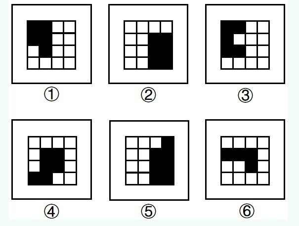

[返回](../index.md)

今天重点，图形题，MD，一道不会，全靠蒙，上题：
1. 把下面六个图形分为两类，使每一类图形都有各自的共同特征和规律，分类正确的一项是：

\
先来说下，图形题会考察哪些内容，常见的有：平移、部分、对称、笔画、奇偶、形状、面积，\
但这道题都不是考察以上，通过解析，考察的是周长\
各图形周长分别是：1:10, 2: 10, 3:12,4:12,5:12,6:10
所以相同的组合是：1，2，6；2，3，5

[返回](../index.md)