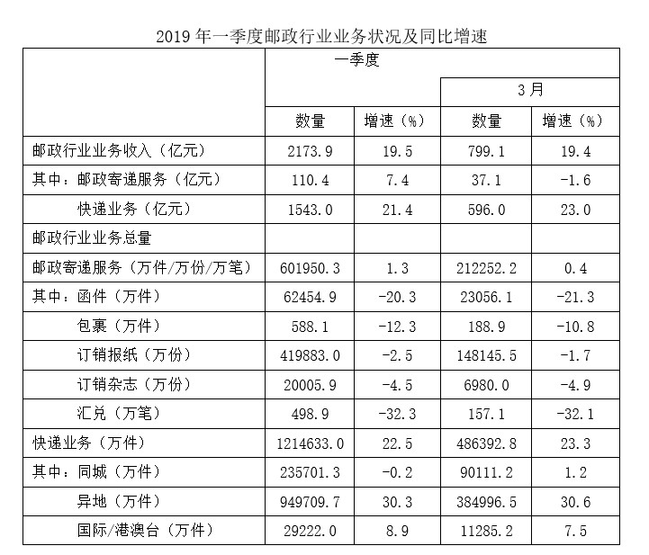

[返回](../index.md)

资料分析题，比较简单，但是如果掌握不了技巧，计算量超大，比较耗时间

如题：

题1： 2019年1~2月，我国包裏寄递量比去年同期：\
A. 下降了不到10%\
B. 下降了10%以上\
C. 上升了不到10%\
D. 上升了10%以上\
\
解析：\
这道题，如果硬算是能算出来的，但是非常耗时间\
技巧：\
根据题干“2019年1~2月······比去年同期”，选项为“上升/下降+%”，结合材料给出2019年一季度和2019年3月我国包裏寄递量及其同比增速，可判定本题为混合增长率问题。定位统计表可得：2019年一季度，我国包裏寄递量为588.1万件，同比增速为-12.3%；2019年3月，我国包裏寄递量为188.9万件，同比增速为-10.8%。根据混合增长率口诀“混合后居中”,所以1~2月份增速在-12.3%~-10.8%之间，首先肯定是下降了，下降超过10%，所以选B

题2：
在①同城快递、②异地快递和③国际/港澳台快递中，2019年3月业务量占一季度比重高于2018年3月业务量占一季度比重的是：\
A. 仅①\
B. 仅③\
C. 仅①和②\
D. 仅②和③

解析:\
根据题干“······2019年3月······占一季度比重高于2018年3月······占一季度比重的是”，可判定本题为两期比重比较问题。定位统计表可得同城快递、异地快递和国际/港澳台快递2019年3月业务量的同比增速（a）和一季度业务量的同比增速（b）。根据两期比重比较结论：若部分增长率（a）＞整体增长率（b），则比重上升，因①同城快递1.2%＞-0.2%，②异地快递30.6%＞30.3%，③国际/港澳台快递7.5%＜8.9%，则仅①和②满足要求。

故正确答案为C。

关键技巧：混合增长率问题、两期比重比较问题、间隔增长率问题

[返回](../index.md)