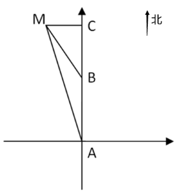

[返回](../index.md)

上周二开始脸发麻，心里慌的一批，不敢请假去医院，坚持到周末今天去看，幸好没事，今天继续开始！

1. 一艘轮船在点A处测得灯塔M在北偏西，向北航行了20千米后到达B点，测得灯塔M在北偏西。此后该船继续向北航行，在到达灯塔正东方向C处时，轮船与灯塔M的距离为多少千米？\
A. 10\
B. 12\
C. 6√3\
D. 20(2-√3)\
\
典型的三角函数，如图：\
\
其中AB为20，MAB为15°，MBC为30°，根据内角和可算出ABM为15°，所以三角形AMB为等腰三角形，所以MB=AB=20km\
30°角对边比斜边为1/2，所以MC为10km，正确答案为A

2. 北京冬奥会期间，冬奥会吉祥物“冰墩墩”纪念品十分畅销。销售期间某商家发现，进价为每个40元的“冰墩墩”，当售价定为44元时，每天可售出300个，售价每上涨1元，每天销量减少10个。现商家决定提价销售，若要使销售利润达到最大，则售价应为：\
A 51元\
B 52元\
C 54元\
D 57元\
\
设“冰墩墩”纪念品售价共上涨x元，销售利润为y元。根据题意，可列方程：\
y=(44-40+x)*(300-10x),x1=-4,x2=30，当x=(x1+x2)/2为13

3. 单位将10个培训名额分配给4个分公司，要求在每个分公司至少分配1个名额的所有分配方案中，随机选择1个方案实施，问4个分公司中有3个分配名额数量相同的概率为多少？\
A. 3/50\
B. 1/10\
C. 3/25\
D. 1/7\
将n个相同元素分给m个不同主体，至少1个：C(m-1)(n-1)，即得到：
总的：C(3)(9) = 84，满足条件的情况：(1,1,1,7)(2,2,2,4)(3,3,3,1)总共12种情况,故：12/84 = 1/7

[返回](../index.md)