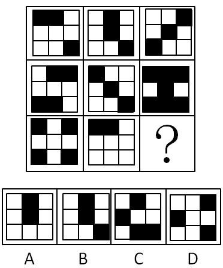
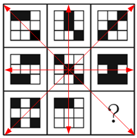

[返回](../index.md)

注：04/06专心做图形题，6号不做笔记

一道正确率只有25.5%的题目：

问号处填什么?\

这道题，既不符合平移，又不能横轴相加

一张图解析：\

元素组成相似，元素叠加。

如图所示，九宫格四条对称轴上的图形，两两叠加均可以得到另外一个图形。具体叠加规律：相同颜色部分叠加后变为白色，不同颜色部分叠加后变为黑色，只有A符合条件

[返回](../index.md)